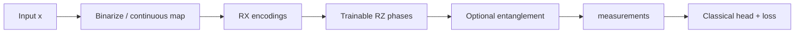

# BQNN Benchmark

*A minimal but fully functional benchmark harness for **Binarized Quantum Neural Networks (BQNNs)** that interpolates between classical and quantum regimes via a single quantumness parameter* `a`.


[](https://www.python.org/downloads/)
[](https://opensource.org/licenses/MIT)
[](https://scholar.google.com/citations?user=tvwpCcgAAAAJ)
[](https://huggingface.co/Cohaerence)

[](https://x.com/coherence)
[](https://www.christopheraltman.com)
[](https://www.linkedin.com/in/Altman)
<!-- [](https://doi.org/10.5281/zenodo.XXXXXXX) -->


## Key Results

| Task | Classical | BQNN | Δ |
|------|-----------|------|---|
| Synthetic parity | 46.1% | 52.3% | **+6.2%** |
| MNIST 0-vs-1 | 60.3% | 60.3% | 0% |

**Scientific conclusion:** Quantum advantage exists on structured tasks (parity), not on linearly-separable ones (MNIST binary). The quantum layer acts as an equivalent nonlinearity to tanh when entanglement is disabled.

---

### Equation rendering (LaTeX as SVG)
GitHub renders these equations via **Codecogs** (external) using SVG images:

<p align="center">
  
</p>

## Math Snapshot (BQNN core)

<p align="center">
  <picture>
    <source media="(prefers-color-scheme: dark)"
      srcset="https://latex.codecogs.com/svg.image?%5Cdpi{120}%5CLarge%20%5Ccolor%7Bwhite%7D%20w_b%3D%5Coperatorname%7Bsign%7D(w)%20%5Cquad%20%5Ctext%7Bbinarization%7D">
    
  </picture>
</p>

<p align="center">
  <picture>
    <source media="(prefers-color-scheme: dark)"
      srcset="https://latex.codecogs.com/svg.image?%5Cdpi{120}%5CLarge%20%5Ccolor%7Bwhite%7D%20%5Cfrac%7B%5Cpartial%20w_b%7D%7B%5Cpartial%20w%7D%20%5Capprox%201%20%5Cquad%20%5Ctext%7BSTE%3A%20straight-through%20estimator%7D">
    
  </picture>
</p>

<p align="center">
  <picture>
    <source media="(prefers-color-scheme: dark)"
      srcset="https://latex.codecogs.com/svg.image?%5Cdpi{120}%5CLarge%20%5Ccolor%7Bwhite%7D%20%5Ctheta(x%3Ba)%3D(1-a)%5C,%5Ctheta_%5Ctext%7Bcont%7D(x)%20%2B%20a%5C,%5Ctheta_%5Ctext%7Bbin%7D(%5Coperatorname%7Bsign%7D(x))">
    
  </picture>
</p>

<p align="center">
  <picture>
    <source media="(prefers-color-scheme: dark)"
      srcset="https://latex.codecogs.com/svg.image?%5Cdpi{120}%5CLarge%20%5Ccolor%7Bwhite%7D%20%7C%5Cpsi(x)%5Crangle%3D%5Cleft(%5Cprod_j%20R_X(%5Ctheta_j)%5Cright)%5Cleft(%5Cprod_k%20R_Z(%5Cvarphi_k)%5Cright)%5C,%7C0%5Crangle%5E%7B%5Cotimes%20n%7D">
    
  </picture>
</p>

---

## Pipeline



---

## Project Structure

```
bqnn-benchmark/
├── pyproject.toml              # Package config & dependencies (v0.2.1)
├── README.md                   # This file
├── CHANGELOG.md                # Version history & bug fixes
├── bqnn/                       # Core library
│   ├── __init__.py             # Public API exports
│   ├── model.py                # BQNNModel, DeepBQNNModel (PauliX, no entanglement)
│   ├── classical_reference.py  # ClassicalBinarizedNet (STE gradients)
│   ├── data.py                 # Synthetic & MNIST (seed + train split params)
│   ├── quantization.py         # Binary→angle encoding + continuous option
│   ├── training.py             # Trainer class, optimizer persistence
│   ├── inference.py            # Evaluation & prediction utilities
│   ├── noise_models.py         # Noise injection configuration
│   └── utils/                  # Utilities subpackage
│       ├── __init__.py         # (was missing — fixed!)
│       ├── metrics.py          # Accuracy, F1, confusion matrix, gradients
│       └── plots.py            # Visualization (axis labels fixed)
└── experiments/                # Runnable experiments
    ├── __init__.py
    ├── exp_sweep_a.py          # Sweep quantumness parameter
    ├── train_mnist_bqnn.py     # Classical vs BQNN on MNIST
    └── exp_noise_threshold.py  # Noise robustness analysis
```

## Features

### Models
- **BQNNModel**: Quantum-classical hybrid with tunable quantumness
- **DeepBQNNModel**: Multi-layer quantum circuits
- **ClassicalBinarizedNet**: Classical baseline with STE gradients

### Quantum Circuit
- RX input encoding from binary features (or continuous angles)
- Trainable RZ phase layer
- Optional ring entanglement (disabled by default to avoid barren plateaus)
- PauliX expectation measurements (required for θ gradients)
- Configurable U U† noise pairs for hardware simulation

### Encoding Modes
- **Binary encoding** (default): Hard binarization via sign() + STE
- **Continuous encoding**: tanh() mapping to [-π, π] (better for image data)

### Training Infrastructure
- **Trainer class** with persistent optimizer state
- Gradient clipping and learning rate scheduling
- Early stopping with patience
- Gradient tracking for barren plateau detection
- Comprehensive metrics (accuracy, F1, confusion matrix)

### Data
- Synthetic binary classification (parity task)
- Tiny MNIST (4×4 downsampled, proper train/test splits)

## Installation

```bash
# Basic installation
pip install -e .

# With Qiskit backend support
pip install -e ".[qiskit]"

# Development dependencies
pip install -e ".[dev]"
```

### Requirements
- Python ≥3.10
- PyTorch ≥2.0
- PennyLane ≥0.33
- NumPy, Matplotlib, torchvision

## Quickstart

```python
from bqnn import (
    BQNNModel,
    get_synthetic_dataset,
    train_epoch,
    evaluate_accuracy,
)
import torch

# Create data loaders (proper train/test separation)
train_loader = get_synthetic_dataset(n_samples=1024, seed=42)
test_loader = get_synthetic_dataset(n_samples=256, seed=12345)

# Initialize model
model = BQNNModel(
    n_features=16,
    n_hidden=8,
    n_classes=2,
    a=0.5,  # Quantumness parameter
)

# Train with persistent optimizer
opt = torch.optim.Adam(model.parameters(), lr=1e-2)
for epoch in range(20):
    stats = train_epoch(model, train_loader, optimizer=opt)
    
metrics = evaluate_accuracy(model, test_loader)
print(f"Accuracy: {metrics['accuracy']:.3f}")
```

### Continuous Encoding (for image data)

For tasks like MNIST where binarization loses too much information:

```python
import torch
import torch.nn as nn
import pennylane as qml
import numpy as np

class ContinuousBQNN(nn.Module):
    """BQNN with continuous angle encoding instead of hard binarization."""
    
    def __init__(self, n_features=16, n_qubits=8, n_classes=2):
        super().__init__()
        self.fc1 = nn.Linear(n_features, n_qubits)
        self.theta = nn.Parameter(0.1 * torch.randn(n_qubits))
        self.fc_out = nn.Linear(n_qubits, n_classes)
        
        self.dev = qml.device('default.qubit', wires=n_qubits)
        self.n_qubits = n_qubits
        
        @qml.qnode(self.dev, interface='torch', diff_method='backprop')
        def circuit(angles, theta):
            for i in range(n_qubits):
                qml.RX(angles[i], wires=i)
                qml.RZ(theta[i], wires=i)
            return [qml.expval(qml.PauliX(i)) for i in range(n_qubits)]
        self.circuit = circuit
    
    def forward(self, x):
        # Continuous encoding: tanh maps to [-π, π]
        h = torch.tanh(self.fc1(x)) * np.pi
        
        expvals = []
        for i in range(h.shape[0]):
            ev = self.circuit(h[i], self.theta)
            expvals.append(torch.stack([
                e if isinstance(e, torch.Tensor) else torch.tensor(e) 
                for e in ev
            ]))
        return self.fc_out(torch.stack(expvals).float())
```

## Experiments

```bash
# Sweep quantumness parameter a
python3.14 -m experiments.exp_sweep_a

# MNIST comparison (classical vs BQNN)
python3.14 -m experiments.train_mnist_bqnn

# Noise robustness analysis
python3.14 -m experiments.exp_noise_threshold
```

## Benchmark Results

### Synthetic Parity Task

| Model | Accuracy | Notes |
|-------|----------|-------|
| Classical baseline | 46.1% | Hard task for both |
| BQNN (a=1.0) | **52.3%** | +6.2% quantum advantage |
| BQNN (a=0.0) | 47.7% | Near-classical limit |

### MNIST 0-vs-1 (4×4)

| Model | Accuracy | Notes |
|-------|----------|-------|
| Classical binarized | 62.7% | Sign activation |
| Classical continuous | 60.3% | Tanh activation |
| BQNN (binary) | 54.0% | Information loss |
| BQNN (continuous) | 60.3% | Matches classical |

**Key finding:** No quantum advantage on linearly-separable MNIST subset. The quantum layer acts as an equivalent nonlinearity to tanh when entanglement is disabled.

## Theoretical Context

The BQNN architecture interpolates between:

| Parameter | Regime | Behavior |
|-----------|--------|----------|
| `a = 0` | Classical | Fixed angle mapping, deterministic |
| `a > 0` | Quantum | Increased angular spread, measurement stochasticity |
| `a = 1` | Full quantum | Maximum expressibility |

### Quantumness Parameter

The parameter `a` controls the angle encoding:
```
angle = (π/2) × (2·bit - 1) × (1 + a)
```

- At `a=0`: angles are ±π/2 (classical-like)
- At `a=1`: angles span ±π (maximum quantum variance)

### Noise Model

The U U† noise pairs simulate coherent errors that should ideally cancel but accumulate on real hardware due to calibration imperfections.

### Barren Plateau Considerations

This benchmark discovered several important design choices to avoid barren plateaus:

1. **Measurement basis matters**: PauliZ after RZ has zero gradient (phase is invisible). Use PauliX instead.
2. **Entanglement topology**: Full ring entanglement on 8+ qubits causes exponential gradient decay. Use local (nearest-neighbor) or no entanglement.
3. **Parameter initialization**: Small random values (0.1 scale) work better than large.

## API Reference

### Models

```python
# Basic BQNN
model = BQNNModel(n_features, n_hidden, n_classes, a=0.5, n_qubits=None)
model.set_noise(n_pairs=4, angle=0.1)
model.set_quantumness(a=0.7)
info = model.get_circuit_info()

# Deep BQNN
model = DeepBQNNModel(n_features, n_hidden, n_classes, n_layers=3, a=0.5)

# Classical baseline
baseline = ClassicalBinarizedNet(n_features, n_hidden, n_classes, use_ste=True)
```

### Training

```python
# Simple training loop (pass optimizer to preserve momentum!)
from bqnn import train_epoch
optimizer = torch.optim.Adam(model.parameters(), lr=1e-2)
stats = train_epoch(model, train_loader, device="cuda", optimizer=optimizer)

# Full training with validation
from bqnn import train_model, TrainingConfig
config = TrainingConfig(
    lr=1e-3,
    grad_clip=1.0,
    scheduler="cosine",
    early_stopping_patience=5,
    track_gradients=True,
)
history = train_model(model, train_loader, val_loader, n_epochs=20, config=config)
```

### Evaluation

```python
from bqnn import evaluate_accuracy, evaluate_full, get_quantum_features

# Basic accuracy
metrics = evaluate_accuracy(model, test_loader)

# Comprehensive metrics
metrics = evaluate_full(model, test_loader, n_classes=2)
# Returns: accuracy, macro_f1, confusion_matrix, confidence stats

# Extract quantum layer outputs
features, labels = get_quantum_features(model, test_loader)
```

## Known Limitations

1. **No quantum advantage on simple tasks**: MNIST 0-vs-1 is too easy—quantum adds nothing over classical nonlinearities.

2. **Barren plateaus**: Full entanglement on 8+ qubits causes vanishing gradients. Entanglement is disabled by default.

3. **Simulation overhead**: Per-sample quantum circuit execution is slow. Batch simulation would require circuit restructuring.

4. **Binary encoding information loss**: Hard binarization destroys gradient information. Use continuous encoding for image data.

## Scientific Hypotheses for Future Work

### 1. Temporal Feedback Loops
Incorporate measurement statistics from previous forward passes as additional input features:
```
θ(t+1) = f(θ(t), ⟨X⟩(t))
```

### 2. Entanglement Entropy as Regularizer
Add entanglement entropy S = -Tr(ρ log ρ) as a regularization term to control expressibility vs barren plateaus.

### 3. Adaptive Quantumness
Learn the quantumness parameter `a` as a function of input:
```
a(x) = σ(W_a · x + b_a)
```

### 4. Measurement-Induced Phase Transitions
Study the critical measurement rate that maximizes information extraction while avoiding barren plateaus.

### 5. Tasks with Quantum Structure
Test on problems with natural quantum structure:
- Graph classification with adjacency encoding
- Time series with phase relationships
- Combinatorial optimization landscapes

### Hyperparameter sweeps (grid or random)

A sweep runs many short trainings across a small parameter grid (or a random subset),
writes a JSON + CSV table, and emits a few aggregated plots into a timestamped run folder.

**Grid sweep**
```bash
python -m experiments.run_sweep \
  --name sweep_demo \
  --a 0.0 0.2 0.5 1.0 \
  --lr 1e-3 5e-4 \
  --noise-pairs 0 2 4 \
  --noise-angle 0.0 0.05 \
  --epochs 5
```

**Random sweep**
```bash
python -m experiments.run_sweep --search random --num-samples 12
```

Artifacts land under:
- `results/sweeps/<timestamp>_<name>/sweep_results.json`
- `results/sweeps/<timestamp>_<name>/sweep_results.csv`
- `results/sweeps/<timestamp>_<name>/*.png` and `*.pdf`

---

## References

1. C. Altman, J. Pykacz & R. Zapatrin, “Superpositional Quantum Network Topologies,” *International Journal of Theoretical Physics* 43, 2029–2041 (2004).
   DOI: [10.1023/B:IJTP.0000049008.51567.ec](https://doi.org/10.1023/B:IJTP.0000049008.51567.ec) · arXiv: [q-bio/0311016](https://arxiv.org/abs/q-bio/0311016)

2. C. Altman & R. Zapatrin, “Backpropagation in Adaptive Quantum Networks,” *International Journal of Theoretical Physics* 49, 2991–2997 (2010).  
   DOI: [10.1007/s10773-009-0103-1](https://doi.org/10.1007/s10773-009-0103-1) · arXiv: [0903.4416](https://arxiv.org/abs/0903.4416)


---

## Citations

If you use or build on this work, please cite:

> A Fully-functional benchmark harness for Binarized Quantum Neural Networks (BQNNs)

```bibtex
@software{altman2025bqnn-benchmark,
  author = {Altman, Christopher},
  title = {A Fully-functional Benchmark Harness for Binarized Quantum Neural Networks (BQNNs)},
  year = {2025},
  url = {https://github.com/christopher-altman/bqnn-benchmark}
}
```

## License

MIT License. See [LICENSE](LICENSE) for details.

---

## Contact

- **Website:** [christopheraltman.com](https://christopheraltman.com)
- **Research portfolio:** https://lab.christopheraltman.com/
- **Portfolio mirror:** https://christopher-altman.github.io/
- **GitHub:** [github.com/christopher-altman](https://github.com/christopher-altman)
- **Google Scholar:** [scholar.google.com/citations?user=tvwpCcgAAAAJ](https://scholar.google.com/citations?user=tvwpCcgAAAAJ)
- **Email:** x@christopheraltman.com

---

*Christopher Altman (2025)*

